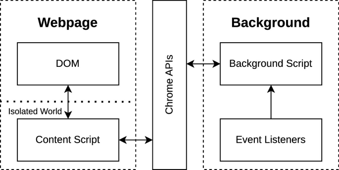

Building a Chrome Extension: A Hands-On Guide for CS Majors
===========================================================

Introduction
------------

Chrome extensions are powerful tools that enh ance browser functionality, automate tasks, and improve productivity. Whether you're a beginner or an experienced developer, building a Chrome extension is a great way to apply web development skills in a practical setting. This guide will walk you through the fundamentals of Chrome extension development and include hands-on challenges to test your skills!

* * * * *

Understanding Chrome Extension Architecture
-------------------------------------------

A Chrome extension consists of several key components:

-   **Manifest File (**`**manifest.json**`**)** -- Defines metadata and permissions.

-   **Background Scripts** -- Runs in the background and listens for browser events.

-   **Content Scripts** -- Injects JavaScript into web pages.

-   **Popup UI** -- Provides an interface for users to interact with the extension.

-   **Permissions** -- Controls access to browser features and web requests.

### Basic Folder Structure

```
my-extension/
│── manifest.json
│── background.js (optional)
│── content.js (optional)
│── popup.html (optional)
│── popup.js (optional)
│── icons/ (optional)
```

### Chrome extension architecture



* * * * *

Setting Up Your First Chrome Extension
--------------------------------------

### 1\. Creating the Manifest File

Every Chrome extension needs a `manifest.json` file to define its structure and behavior. Here's a basic example:

```
{
  "manifest_version": 3,
  "name": "My First Extension",
  "version": "1.0",
  "description": "A simple Chrome extension",
  "permissions": ["storage", "activeTab"],
  "background": { "service_worker": "background.js" },
  "action": { "default_popup": "popup.html" }
}
```

### 2\. Writing Background and Content Scripts

**Background Script Example (**`**background.js**`**)**

```
chrome.runtime.onInstalled.addListener(() => {
  console.log("Extension Installed");
});
```

**Content Script Example (**`**content.js**`**)**

```
document.body.style.backgroundColor = "lightblue";
```

### 3\. Creating a Popup UI

**Popup HTML (**`**popup.html**`**)**

```
<button id="clickMe">Click Me</button>
<script src="popup.js"></script>
```

**Popup JavaScript (**`**popup.js**`**)**

```
document.getElementById("clickMe").addEventListener("click", () => {
  alert("Hello from your extension!");
});
```

### 4\. Loading and Testing Your Extension

1.  Open Chrome and go to `chrome://extensions/`.

2.  Enable "Developer mode".

3.  Click "Load unpacked" and select your extension folder.

4.  Test it out!

* * * * *

Challenges: Test Your Knowledge!
--------------------------------

### **Easy Challenge (10 Points Each)**

1.  **Modify Page Color** -- Change the background color of a website to **light blue**.

2.  **Popup Message** -- Add a button to the popup that displays an alert when clicked.

3.  **Change Tab Title** -- Modify the title of the current webpage to **"Hello, World!"**.

### **Medium Challenges (30 Points Each)**

1.  **Save and Restore User Input** -- Create a popup with a text input field that saves what the user types and restores it when reopened.

2.  **Replace Words on a Webpage** -- Replace all instances of "the" with "🚀" on any website.

3.  **Dynamic Background Changer** -- Let users pick a background color from the popup and apply it to all webpages.

### **Hard Challenges (40 Points Each)**

1.  **Block a Specific Website** -- Prevent access to a specific website (e.g., YouTube) by redirecting to another page.

2.  **Track Browsing Time** -- Count the total time a user spends on a specific website and display it in the popup.

3.  **Context Menu Actions** -- Add a right-click menu option that lets users highlight text and copy it to the clipboard automatically.

4.  **Web Scraper & Notification** -- Scrape the price of a product from a shopping website and display it to the user in the popup or send an alert message.

* * * * *

Debugging and Publishing Your Extension
---------------------------------------

### Debugging Tips

-   Use `console.log()` to debug scripts.

-   Open Chrome DevTools (`F12` or `Ctrl+Shift+I`) to inspect errors.

-   Check `chrome://extensions/` for extension-related issues.

### Publishing Your Extension

1.  Create a **developer account** on the Chrome Web Store.

2.  Zip your extension folder.

3.  Submit it for review with a description and screenshots.

* * * * *

Conclusion
----------

Building a Chrome extension is an exciting way to enhance your web development skills. Start with the basics, experiment with different functionalities, and challenge yourself with the hands-on exercises. Have fun coding!

**Resources:**

-   Chrome Extensions Docs

-   [MDN Web Docs](https://developer.mozilla.org/en-US/docs/Mozilla/Add-ons/WebExtensions)

-   [Chrome Extension Examples](https://developer.chrome.com/docs/extensions/samples)

- [https://developer.chrome.com/docs/extensions/develop](https://developer.chrome.com/docs/extensions/develop)

Happy coding! 🚀